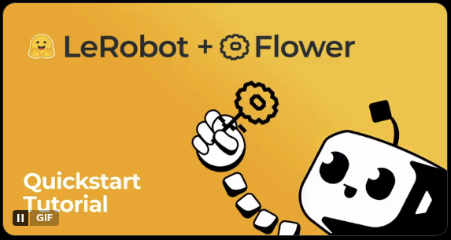

# zk0 [zee-ˈkō]

Open Source Humanoid AI trained collaboratively by a community of builders.

First Milestone:

[](https://x.com/flwrlabs/status/1879571258532036739)

Ultimate Goal and Massive Transformative Purpose:

<a href="https://imagine-public.x.ai/imagine-public/share-videos/3332fbd2-7b73-4986-9ce5-6f4029569d89.mp4?cache=1"></a>

## 🚀 **Latest Model Release**

The zk0 SmolVLA Federated Learning model is now available on Hugging Face Hub!

You can also [read this post](https://open.substack.com/pub/ivelin117/p/decentralizing-robot-brains-zk0bot?r=42d25&utm_campaign=post&utm_medium=web&showWelcomeOnShare=false) with more detailes about the SmolVLA FL milestone.

For the latest extended run results (250 rounds, final loss 0.495) and analysis on skill retention, see the [Update: SmolVLA Federated Learning Progress](https://open.substack.com/pub/ivelin117/p/update-smolvla-federated-learning?r=42d25&utm_campaign=post&utm_medium=web), which includes WandB visualizations.

- **Model**: [ivelin/zk0-smolvla-fl](https://huggingface.co/ivelin/zk0-smolvla-fl)
- **Training**: 250 rounds of federated learning with FedProx (μ=0.01, dynamic LR/MU scheduling)
- **Final Policy Loss**: 0.495
- **Clients**: 4 clients on diverse SO-100 robotics tasks
- **Framework**: Flower + SmolVLA + SO-100 datasets
- **WandB Run**: [zk0-sim-fl-run-2025-10-20_23-44-35](https://wandb.ai/ivelin-eth/zk0/runs/zk0-sim-fl-run-2025-10-20_23-44-35)

```python
from transformers import AutoModel, AutoConfig
import torch

# Load the federated model
model = AutoModel.from_pretrained("ivelin/zk0-smolvla-fl")
config = AutoConfig.from_pretrained("ivelin/zk0-smolvla-fl")

# Ready for robotics manipulation tasks!
```

## Why

AI technology has [advanced enough to speculate](https://x.com/elonmusk/status/1786367513137233933) that within a decade most people will have their own humanoid buddy. By some estimates humanoids will become $100 Trillion market (5B humanoids * $20,000 per unit).

[Today's leading closed source humanoid](https://x.com/Tesla_Optimus/status/1846294753144361371) is trained on [100,000+ GPU farm](https://nvidianews.nvidia.com/news/spectrum-x-ethernet-networking-xai-colossus) with real world data collected from millions of cars labeled by able human drivers and a growing number of humanoid robot prototypes used in real world manufacturing environment. This is an enormous scale of compute and data that is hard to compete with as a centralized entity. However it would be interesting to see if a decentralized approach might produce useful results over time. On the chance that proprietary humanoids ever go rogue, it would be nice to have open source alternatives.

## Community Events

### Upcoming Events

- [Register now](https://lu.ma/embed/event/evt-udINVLo325xhKsG/simple) for the zk0 event at the upcoming DevConnect conference in Buenos Aires, Argentina on November 18, 2025.

<blockquote class="twitter-tweet" data-media-max-width="560"><p lang="en" dir="ltr">Attending <a href="https://twitter.com/EFDevcon?ref_src=twsrc%5Etfw">@EFDevcon</a>? Diving deep into Robotics AI? <br>Join us for the <a href="https://t.co/lkOfzCU5G1">https://t.co/lkOfzCU5G1</a> meetup: Federated Learning for Robotics AI with ZK Proofs.<br><br>The only way to collect a cool <a href="https://t.co/lkOfzCU5G1">https://t.co/lkOfzCU5G1</a> POAP is to be there in person.<a href="https://t.co/UXE5KInLSn">https://t.co/UXE5KInLSn</a> <a href="https://t.co/jx3Mdl5sXm">pic.twitter.com/jx3Mdl5sXm</a></p>&mdash; ivelin.eth 🛡️🤖 (@ivelini) <a href="https://twitter.com/ivelini/status/1983704796948468202?ref_src=twsrc%5Etfw">October 30, 2025</a></blockquote> <script async src="https://platform.twitter.com/widgets.js" charset="utf-8"></script> 


### Past Events

- [Watch a recorded presentation](https://www.youtube.com/embed/fwAtTOZttWo?si=3d50oQtSvMvGxNg6) of the project at the Flower Monthly Webcast.

### Join the Community

Join our Discord server to connect with other contributors, ask questions, and stay updated on the latest developments:

[Join zk0 Discord](https://discord.gg/dhMnEne7RP)

For more detailed contribution guidelines, see [CONTRIBUTING.md](CONTRIBUTING.md) and [docs/DEVELOPMENT.md](docs/DEVELOPMENT.md).

## How

zk0 is composed of several major building blocks:

- Physical Embodiment:
  * Open Source 3D printed robot parts
  * Base: 3D model so100 series from [HuggingFace LeRobot](https://huggingface.co/lerobot)
- Generative AI:
  * End-to-end Vision Language Action models.
  * Base: SmolVLA model from [HuggingFace LeRobot](https://huggingface.co/lerobot)
- Federated Learning:
  * Distributed network of nodes contributing local data and training compute to a shared model.
  * Base: [Flower FL framework](https://flower.ai/)

## Roadmap

- Zero Knowledge Proofs that allow quick verification and data privacy:
  * Quickly verifiable proofs that an FL node is making meaningful contributions.
  * Frameworks under consideration:
    * [SP1](https://github.com/succinctlabs/sp1)
    * [EZKL](https://github.com/zkonduit/ezkl)
- Onchain contributor coordination
  * Immutable contribution history
  * Programmable network participation rules, incentives and project governance
  * Hosting blockchain: TBD

## Quick Start

For detailed setup, see [docs/INSTALLATION.md](docs/INSTALLATION.md).

### Prerequisites

- Python 3.10+, Conda, Git.
- NVIDIA GPU recommended.

### Clone and Setup

```shell
git clone <repository-url> .
cd zk0

# Create conda env
conda create -n zk0 python=3.10 -y
conda activate zk0
conda install ffmpeg=7.1.1 -c conda-forge

# Install deps
pip install -e .

# Env vars
cp .env.example .env  # Edit as needed (e.g., HF_TOKEN)
```

### Run the Simulation

See [docs/RUNNING.md](docs/RUNNING.md) for full instructions.

```bash
# Quick test (1 round, serialized GPU)
./train.sh

# Full run (5 rounds)
conda run -n zk0 flwr run . local-simulation-serialized-gpu --run-config "num-server-rounds=5"

# Docker alternative
./train.sh --docker
```

### Push Model to Hugging Face Hub

After training, your model checkpoint will be automatically pushed to Hugging Face Hub as a complete checkpoint directory.
However if the training stops early for any reason, you can still push a saved intermediate checkpoint directory to HF Hub:

```bash
# Push model checkpoint directory to HF Hub
conda run -n zk0 python -m zk0.push_to_hf outputs/2025-10-09_13-59-05/models/checkpoint_round_30

# Push to custom repository
conda run -n zk0 python -m zk0.push_to_hf outputs/2025-10-09_13-59-05/models/checkpoint_round_30 --repo-id your-username/your-model
```


- **Defaults**: 500 rounds, 4 clients, SO-100/SO-101 datasets.
- **Outputs**: `outputs/<timestamp>/` with logs, metrics, charts (`eval_policy_loss_chart.png`), checkpoint directories, videos.
- **HF Hub Push**: For tiny/debug runs (e.g., `num-server-rounds < checkpoint_interval=20`), the final model push to Hugging Face Hub is skipped to avoid repository clutter with incomplete checkpoints. Local checkpoints are always saved. Full runs (≥20 rounds) will push to the configured `hf_repo_id`.

**Tested**: Completes 500 rounds in ~10-15 minutes; policy loss tracks convergence with early stopping.

## Repository Branches

- **main**: Stable releases. Use this for production setups and quick starts.
- **staging**: Final polish before merging with main. No new features. Only bug fixes and docs polish.
- **dev**: Active feature development. Pull requests should target dev. Clone or switch with `git checkout dev` for latest features (may be unstable).

## Project Status

### 🚀 Current Stage: Beta

Advanced development with core FL for SmolVLA on SO-100/SO-101. v0.3.11 updates: CI workflow consolidation with single matrix job for cleaner testing, lerobot CI fixes, Python 3.10 standardization, and removed redundant artifacts. Enhanced security with bidirectional SHA256 parameter validation between client and server. Consolidated metrics implementation for unified reporting. Dynamic LR/MU scheduling with warm restarts, adaptive boosts, and spike detection. Prepare for commit workflow established for consistent code quality assurance.

#### Completed Milestones

- ✅ Core Infrastructure: Flower 1.20.0 + Ray 2.31.0 + LeRobot 0.3.0.
- ✅ Client Implementation: SmolVLA training, dataset partitioning.
- ✅ Testing: 30%+ coverage, unit/integration suites.
- ✅ CI/CD: GitHub Actions, auto-testing.
- ✅ Config/Tooling: YAML datasets, env management.
- ✅ Enhanced Security: Bidirectional SHA256 parameter validation.
- ✅ Consolidated Metrics: Server-side evaluation files now include both aggregated and individual client metrics with dataset identification (v0.1.19).

#### In Progress

- Preparing client and server modules for production deployment
- ZK proofs, onchain coordination.

Full status: [docs/ARCHITECTURE.md](docs/ARCHITECTURE.md#project-status). Baselines: [docs/TECHNICAL-OVERVIEW.md](docs/TECHNICAL-OVERVIEW.md#federated-vs-centralized-training-comparison).

**Config**: 12 clients available (4 active: LEGO bin, direction test, plush toy, stuffed animal); 500 rounds; policy loss metric; FedProx (μ=0.01); server-side evaluation with 3 diverse evaluation datasets.

## Documentation

- [Installation](docs/INSTALLATION.md): Full setup.
- [Running](docs/RUNNING.md): Execution, outputs, troubleshooting.
- [Architecture](docs/ARCHITECTURE.md): FL design, components.
- [Development](docs/DEVELOPMENT.md): Testing, logging, guidelines.
- [Technical Overview](docs/TECHNICAL-OVERVIEW.md): Comparisons, reproducibility, videos.

## Contributing

We welcome contributions from the community! At this Beta stage, we're particularly interested in:

### Node Operators

#### Requirements

- **Hardware**: LeRobot SO100 or SO101 robotic arm. Contributors can either:
  - Build a DIY arm using the official [LeRobot SO101 repository](https://huggingface.co/docs/lerobot/so101)
  - Or order a pre-built kit, for example [this one](https://www.ebay.com/str/ovobot) from Florin who runs the [Austin Robotics Meetup](https://austinrobotics.io/).
- **Compute**: Local machine with RTX 3090 GPU or better, compatible with LeRobot library
- **Network**: Stable internet connection for federated communication
- **Data**: Unique training data from your robotics setup

If you meet these requirements, we'd love for you to join as a node operator. Your unique training data and compute resources will help improve the federated learning system. For detailed setup instructions, see [CONTRIBUTING.md](CONTRIBUTING.md).

### Other Ways to Contribute

There are several ways you can contribute to this project:

1. **Node Operators**: Join the federated network with your hardware and data
2. **Code Contributors**: Improve the codebase, add features, fix bugs
3. **Documentation**: Help improve documentation and tutorials
4. **Testing**: Report bugs, test new features, improve test coverage
5. **Feedback**: Share your experience and suggestions

For more details on each, see [CONTRIBUTING.md](CONTRIBUTING.md).

## Social Media

<blockquote class="twitter-tweet"><p lang="en" dir="ltr">It's time for a complete open-source stack for autonomy/robotics plus distributed learning. The first step is here: <a href="https://twitter.com/LeRobotHF?ref_src=twsrc%5Etfw">@LeRobotHF</a> + <a href="https://twitter.com/flwrlabs?ref_src=twsrc%5Etfw">@flwrlabs</a> LFG 🚀<a href="https://twitter.com/comma_ai?ref_src=twsrc%5Etfw">@comma_ai</a> <a href="https://twitter.com/wayve_ai?ref_src=twsrc%5Etfw">@wayve_ai</a> <a href="https://twitter.com/Figure_robot?ref_src=twsrc%5Etfw">@Figure_robot</a> <a href="https://twitter.com/Tesla?ref_src=twsrc%5Etfw">@Tesla</a> <a href="https://t.co/8O8cSD3SbO">https://t.co/8O8cSD3SbO</a> <a href="https://t.co/oVUOLTvwzm">https://t.co/oVUOLTvwzm</a></p>&mdash; nic lane (@niclane7) <a href="https://twitter.com/niclane7/status/1879597539676266726?ref_src=twsrc%5Etfw">January 15, 2025</a></blockquote> <script async src="https://platform.twitter.com/widgets.js" charset="utf-8"></script>

<blockquote class="twitter-tweet"><p lang="en" dir="ltr">Open-source robots just got a boost. Frameworks like Flower FL enable faster learning, efficient scaling, and continuous knowledge sharing using real-world data. <a href="https://t.co/j8VSGiWF0W">https://t.co/j8VSGiWF0W</a></p>&mdash; 𝚐𝔪𝟾𝚡𝚡𝟾 (@gm8xx8) <a href="https://twitter.com/gm8xx8/status/1879633368427761785?ref_src=twsrc%5Etfw">January 15, 2025</a></blockquote> <script async src="https://platform.twitter.com/widgets.js" charset="utf-8"></script>

<blockquote class="twitter-tweet"><p lang="en" dir="ltr">We are not so far from a future where robots will be constantly learning by interacting with humans and their environments.<br><br>Frameworks like <a href="https://twitter.com/flwrlabs?ref_src=twsrc%5Etfw">@flwrlabs</a> will enable these robots to learn much faster by continuously sharing their learnings.<br><br>We really live in a sci-fi movie 😅 <a href="https://t.co/kAz3xZ2qvB">https://t.co/kAz3xZ2qvB</a></p>&mdash; Remi Cadene (@RemiCadene) <a href="https://twitter.com/RemiCadene/status/1879592068865282227?ref_src=twsrc%5Etfw">January 15, 2025</a></blockquote> <script async src="https://platform.twitter.com/widgets.js" charset="utf-8"></script>

<blockquote class="twitter-tweet"><p lang="en" dir="ltr">Federated Learning Meets Robotics: 🤖 LeRobot + 🌼 Flower<br><br>This demo demonstrates how robots in remote environments can collaboratively train an AI model using their local data, which is then aggregated into a shared model. <br><br>In this quickstart, you will train a Diffusion policy… <a href="https://t.co/i32MkbxoPW">pic.twitter.com/i32MkbxoPW</a></p>&mdash; Flower (@flwrlabs) <a href="https://twitter.com/flwrlabs/status/1879571258532036739?ref_src=twsrc%5Etfw">January 15, 2025</a></blockquote> <script async src="https://platform.twitter.com/widgets.js" charset="utf-8"></script>


---

<script type="application/ld+json">
{
  "@context": "https://schema.org",
  "@type": "SoftwareApplication",
  "name": "zk0",
  "description": "Open source federated learning platform for decentralized robotics AI with SmolVLA, ZK proofs, and blockchain incentives",
  "applicationCategory": "DeveloperApplication",
  "offers": {"@type": "Offer", "price": "0"},
  "author": {"@type": "Person", "name": "ivelin.eth"},
  "url": "https://zk0.bot",
  "sameAs": ["https://github.com/ivelin/zk0", "https://huggingface.co/ivelin/zk0-smolvla-fl"]
}
</script>

<script type="application/ld+json">
{
  "@context": "https://schema.org",
  "@type": "FAQPage",
  "mainEntity": [
    {
      "@type": "Question",
      "name": "What is zk0?",
      "acceptedAnswer": {
        "@type": "Answer",
        "text": "zk0 is an open source federated learning platform for decentralized robotics AI, enabling collaborative training of SmolVLA models on heterogeneous SO-100 datasets using Flower framework, ZK proofs for verifiable contributions, and blockchain incentives for fair participation."
      }
    },
    {
      "@type": "Question",
      "name": "How does federated learning work in robotics?",
      "acceptedAnswer": {
        "@type": "Answer",
        "text": "Federated learning allows robots to train AI models locally on their private data, sending only model updates to a central server for aggregation. This preserves privacy while building shared knowledge across diverse robotics setups."
      }
    }
  ]
}
</script>

## Share


**License**: [LICENSE](LICENSE)
**Repository**: [GitHub](https://github.com/ivelin/zk0)
