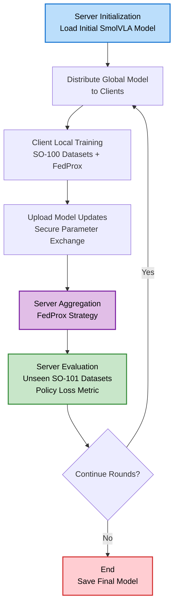

# Architecture

This document provides a detailed overview of the zk0 project's architecture (v0.3.11), focusing on the federated learning system for training SmolVLA models on SO-100 robotics datasets. It adapts key concepts from the project's implementation.

## Overview

The zk0 project implements a federated learning architecture using the Flower framework with SmolVLA models for robotics AI tasks. The system follows a client-server model where multiple clients train models locally on private SO-100 datasets, and a central server coordinates aggregation and evaluation. This ensures privacy-preserving distributed training while achieving performance comparable to centralized approaches.

Key goals:
- Privacy: No raw data leaves client environments.
- Scalability: Supports large number of clients with heterogeneous data.
- Breadth: Enable contributions of edge cases from many diverse environments that no single contributor has access to alone.
- Efficiency: Optimized for GPU/CPU, with automatic device detection.

The architecture is modular, drawing from Flower's quickstart-lerobot example but adapted for SmolVLA and multi-repo datasets.

## Directory Structure

```
zk0/
├── .github/                     # GitHub workflows and configurations
├── .kilocode/                   # Kilo Code configuration and rules
├── docs/                        # Project documentation and images
│   └── images/                  # Images for documentation
├── src/                         # Source code modules
│   ├── configs/                 # Dataset and configuration files
│   └── server/                  # Server utilities and strategies
├── tests/                       # Unit and integration test suites
│   ├── integration/             # End-to-end federated learning tests
│   └── unit/                    # Individual component tests
└── outputs/                     # Generated outputs from runs
```

## Core Components

### Client Layer
- **SmolVLA Models**: Vision-language-action models for robotics manipulation (450M parameters total).
  - Vision Encoder: SigLIP (frozen during training).
  - Language Decoder: SmolLM2.
  - Action Expert: Flow matching transformer (~100M trainable parameters).
- **Local Datasets**: SO-100 real-world robotics datasets, partitioned per client to ensure no overlap.
- **Training Logic**: Local epochs with FedProx regularization (μ=0.01) for heterogeneous convergence.
- **Parameter Exchange**: Secure transmission of model updates to the server.
- **Implementation**: [`src/client_app.py`](src/client_app.py) extends Flower's NumPyClient.


### Server Layer
- **Aggregation Engine**: Flower's FedProx strategy for parameter aggregation.
- **Model Distribution**: Broadcasts updated global model to clients.
- **Orchestration**: Manages rounds, client coordination, and server-side evaluation.
- **Evaluation**: Global model tested on unseen datasets (SO-101 for generalization).
- **Implementation**: [`src/server_app.py`](src/server_app.py) with custom strategy.

### Communication Layer
- **Secure Channels**: TLS-encrypted parameter transmission.
- **Asynchronous Updates**: Supports dynamic client joining/leaving.
- **Bandwidth Optimization**: Parameter compression and efficient serialization.
- **Hash Validation**: Bidirectional SHA256 checks to prevent corruption.

## Training Strategy

### Federated Learning Setup
- **Primary Strategy**: FedProx for handling non-IID SO-100 data (proximal term: μ/2 * ||w - w_global||²). Rationale: Addresses data heterogeneity in SO-100 tasks, stabilizing convergence on diverse robotics manipulation tasks with proximal regularization to anchor local updates to global model.
- **Client Assignments**: 4 clients with unique tasks (e.g., pickplace, stacking) to promote diverse skills.
  - Config: See `[tool.zk0.datasets]` in `pyproject.toml`.
  - Example: Client 0: `lerobot/svla_so100_pickplace` (50 episodes).
- **Data Requirements**:
  - High-quality, unique tasks (no overlap).
  - Fresh data (not used in base SmolVLA pretraining).
  - Eval isolation: Separate unseen datasets.
- **Evaluation**:
  - Server-side on unseen tasks (e.g., SO-101 cross-platform).
  - Metrics: Policy loss (sole metric, ~0.3-1.5 scale) for flow-matching objective.
  - v0.2.3: Consolidated metrics in `round_N_server_eval.json` include both aggregated (avg_client_loss, std_client_loss, etc.) and individual client metrics (per-client policy_loss, fedprox_loss, dataset_name) for unified analysis.

### Data Flow

1. **Initialization**: Server loads/distributes initial SmolVLA model.
2. **Assignment**: Clients receive unique SO-100 subsets.
3. **Local Training**: Clients train (all episodes, 50 epochs/round default).
4. **Upload**: Send updates to server.
5. **Aggregation**: Server combines via FedProx.
6. **Update**: Broadcast global model.
7. **Server Eval**: Test on dedicated datasets (first N episodes).
8. **Repeat**: For configured rounds (e.g., 30).

## Data Flow Diagram

The following Mermaid diagram illustrates the high-level data flow in the federated learning process:



This diagram captures the iterative cycle: model distribution, local training, aggregation, evaluation, and repetition across configured rounds (e.g., 30 rounds).

## Technical Decisions

### Framework Selection
- **Flower**: Simplicity, PyTorch integration, scalability (v1.21.0 with Ray 2.31.0).
- **SmolVLA**: Efficient VLA (layer skipping, visual token reduction) for robotics.
- **SO-100 Datasets**: Standardized format with 30 FPS, multi-view cameras.

### Key Patterns
- **Modular Design**: Separate client/server apps, utils for shared logic.
- **Code Refactoring**: Modularized aggregate_fit() in server_app.py for better maintainability (v0.3.6).
- **HF Push Logic**: Conditional push to Hugging Face Hub for full runs (≥20 rounds) to avoid incomplete checkpoints.
- **Config System**: `pyproject.toml` for FL params, `.env` for secrets, YAML for datasets.
- **Error Handling**: Fail-fast with clear messages; no mocks in production.
- **Logging**: Unified via Loguru (`simulation.log`); client-prefixed metrics.

### Scalability & Performance
- **Horizontal Scaling**: 10+ clients in simulation.
- **GPU Optimization**: AMP support, memory streaming.
- **FedProx Benefits**: Stabilizes convergence on heterogeneous data.
- Benchmarks: 78.3% SO-100 success rate; 30% faster async inference.


## Data Source and Loading

### SO-100/SO-101 Composition
- Multi-modal: RGB images (224x224), states, language instructions.
- Actions: 7-DoF (pose + gripper).
- Episodes: Variable length, 30 FPS.
- Tasks: Pick-place, stacking, etc.

### Loading Mechanism
- Config-driven via [`src/configs/datasets.py`](src/configs/datasets.py).
- Hotfix for doubled data (GitHub #1875).
- Tolerance: 0.0001s (1/30 FPS).
- Partitioning: Episode-based, non-overlapping (`MultiRepoPartitioner`).

Example:
```python
dataset = LeRobotDataset(repo_id="lerobot/svla_so100_pickplace", tolerance_s=0.0001)
```

## Pretrained Model Initialization

- Load fresh `lerobot/smolvla_base` (no SO-100 exposure).
- Freeze vision encoder; train action expert.
- Optimizer: Adam (lr=1e-4), cosine scheduler reset per round.

## Data Partitioning

- Episode-level splitting: `episode_index % num_partitions`.
- Multi-repo: Each client unique dataset.
- Train: All but last N episodes; Eval: Last N.

## Federated Model Aggregation

- FedAvg baseline with FedProx proximal term.
- Weighted by dataset size.
- Hash validation for integrity.

## Progress Demonstration

- Round-by-round eval on unseen data.
- Metrics: Policy loss, success rate.
- Videos: Rollouts in `outputs/evaluate/`.

## Federated vs. Centralized Comparison

- Federated: Privacy high, accuracy ~5-15% lower, more rounds needed.
- Centralized: Optimal but no privacy.
- Reproducibility: Seeds (42), pinned deps.

## Evaluation Videos

- Record episodes post-round.
- Save as MP4 in `outputs/evaluate/round_N/`.
- Analyze for success, duration.

For implementation details, see source files like [`src/task.py`](src/task.py) for training/eval logic.

## References
- Flower Docs: [Quickstart-LeRobot](https://flower.ai/docs/examples/quickstart-lerobot.html).
- LeRobot: [SmolVLA](https://huggingface.co/docs/lerobot/smolvla).
- [TECHNICAL-OVERVIEW.md](TECHNICAL-OVERVIEW.md) for advanced technical details and evaluation mechanisms.
- [DEVELOPMENT.md](DEVELOPMENT.md) for development guidelines and testing.
- [HYPERPARAMETER_ANALYSIS.md](HYPERPARAMETER_ANALYSIS.md) for hyperparameter tuning and analysis.
- [INSTALLATION.md](INSTALLATION.md) for environment setup and execution instructions.