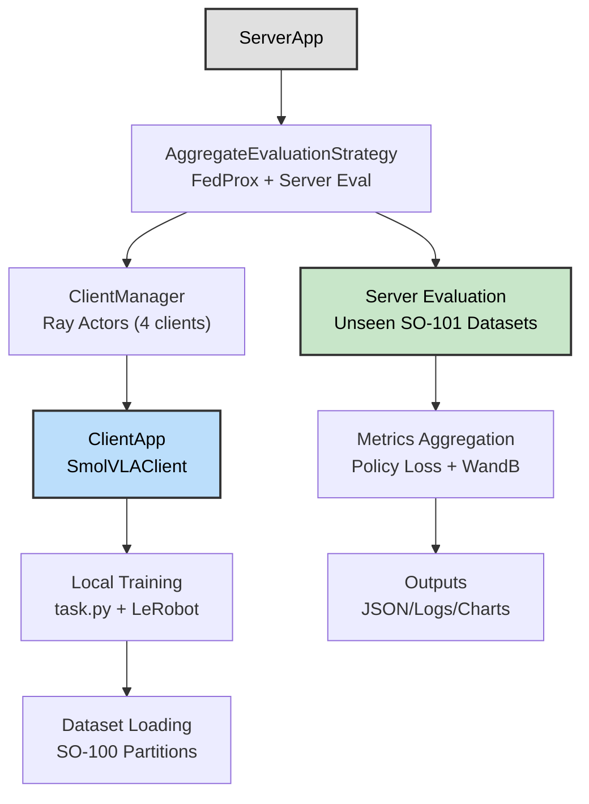
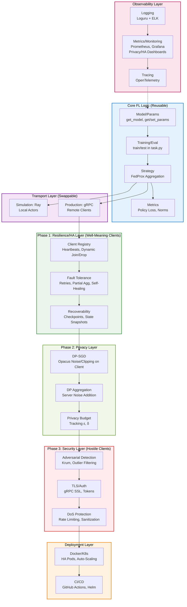
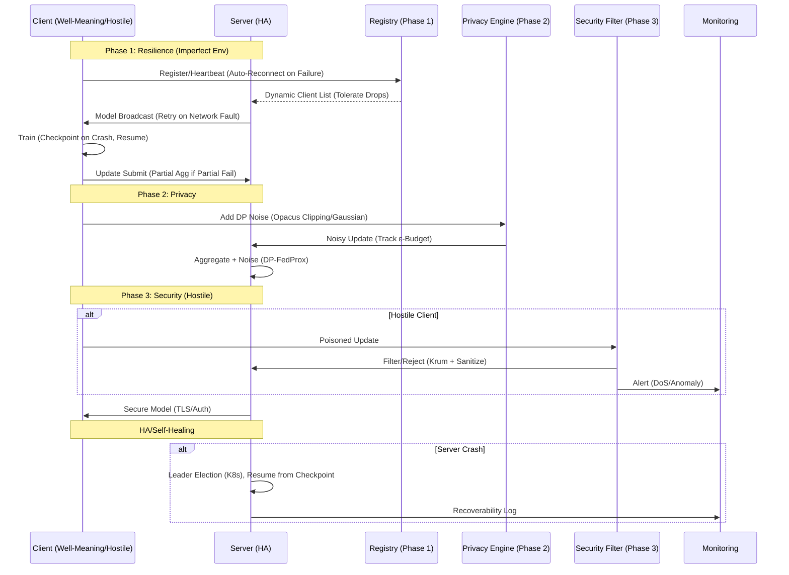
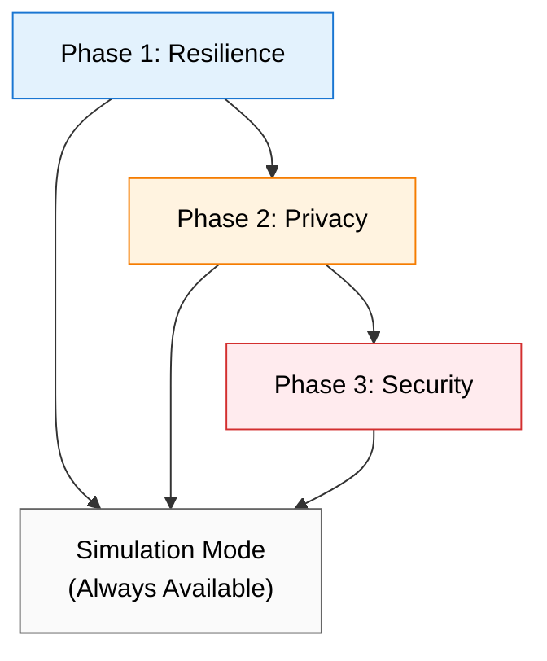

# zk0 Production Deployment Roadmap

**Version**: 1.1.1
**Date**: 2025-10-12
**Author**: Kilo Code (Architect Mode)
**Status**: DRAFT - Pending Review

## Table of Contents
1. [Overview](#overview)
2. [Current Architecture (Simulation Mode)](#current-architecture-simulation-mode)
3. [Proposed Production Architecture](#proposed-production-architecture)
4. [Data Flow in Production FL](#data-flow-in-production-fl)
5. [Roadmap Phases](#roadmap-phases)
   - [Phase 1: Resilience, Fault Tolerance, HA, Self-Healing, Recoverability](#phase-1-resilience-fault-tolerance-ha-self-healing-recoverability)
   - [Phase 2: Client Privacy Protection](#phase-2-client-privacy-protection)
   - [Phase 3: Server & Model Protection from Hostile Clients](#phase-3-server--model-protection-from-hostile-clients)
6. [Phase Dependencies](#phase-dependencies)
7. [Success Metrics](#success-metrics)
8. [Resource Requirements](#resource-requirements)
9. [Rollback Plans](#rollback-plans)
10. [Risks & Mitigations](#risks--mitigations)
11. [Next Steps](#next-steps)

## Overview

This roadmap outlines the expansion from the current stable simulation-based federated learning (FL) setup to a production-ready deployment for real-world SmolVLA training on SO-100 datasets. The plan maintains simulation mode for rapid iteration while introducing resilient, fault-tolerant components for production. It leverages Flower AI's best practices for production deployment, including:

- **gRPC-based Communication**: For secure, efficient client-server interactions (Flower's production transport layer).
- **Dynamic Client Registration**: Clients can join/leave arbitrarily; server maintains a registry without assuming availability (Flower's `ClientManager` with heartbeats).
- **Fault Tolerance**: Robust error handling, retries, and partial aggregation (e.g., Flower's `accept_failures=True`, custom strategies for adversarial clients).
- **High Availability (HA)**: Stateless server design, horizontal scaling, health checks (Kubernetes deployment patterns from Flower docs).
- **Monitoring**: Integrated observability with Prometheus/Grafana, audit logging (Flower's metrics aggregation + OpenTelemetry).
- **Resilience Patterns**: Exponential backoff for reconnections, self-healing (auto-restart, leader election), recoverability (checkpointing, state snapshots).
- **Privacy & Security**: Differential Privacy (DP) for client protection; defenses against hostile clients (e.g., Byzantine-robust aggregation like Krum, rate limiting).

The architecture emphasizes **separation of concerns** with reusable modules:
- **Core FL Logic**: Model training/evaluation (`task.py`), parameter handling – shared between sim/prod.
- **Transport Layer**: Swappable (Ray for sim, gRPC for prod).
- **Resilience Layer**: Heartbeats, failure recovery, self-healing.
- **Privacy Layer**: DP-SGD (Opacus), noise in aggregation.
- **Security Layer**: TLS, auth, adversarial detection.
- **Deployment Layer**: Docker/K8s manifests, CI/CD pipelines.
- **Observability Layer**: Logging, metrics, tracing.

Core features (e.g., FedProx aggregation, SmolVLA training) remain unit-testable in isolation. Production adds overhead only in outer layers. Phases focus on well-meaning clients first (Phase 1), then privacy (Phase 2), then hostile protection (Phase 3).

## Current Architecture (Simulation Mode)

The existing setup uses Flower's simulation mode with Ray for local orchestration. Key components:

**Limitations for Production**:
- Ray simulation assumes all clients available; no dynamic join/drop or network faults.
- Synchronous execution; vulnerable to single-client failures or imperfect environments (e.g., intermittent connectivity).
- No self-healing or recoverability (e.g., no checkpoints on crashes).
- Basic logging; no distributed tracing, privacy, or adversarial defenses.

## Proposed Production Architecture

Layered design with clear boundaries. Core logic reusable; phases build resilience first, then privacy, then security.

**Key Design Principles**:
- **Modularity**: Core unchanged; inject layers via Flower abstractions (e.g., custom `ClientManager` for registry, strategy extensions for DP/security).
- **Phase 1 Resilience**: Assume well-meaning clients; focus on environmental faults (e.g., network blips, crashes). Self-healing: Auto-reconnect, pod restarts. Recoverability: Persistent checkpoints.
- **Phase 2 Privacy**: DP-SGD on clients (Opacus: per-sample gradient noise); server adds aggregation noise. Configurable budget (ε=1.0, δ=1e-5); no inference attacks leak data.
- **Phase 3 Security**: Defend against malicious clients (e.g., poisoned updates via Krum filtering; DoS via gRPC quotas). TLS enforced; audit trails.
- **Scalability**: Server stateless; K8s auto-scales. Clients register dynamically.
- **Backward Compatibility**: Simulation uses Ray; prod gRPC without core changes.
- **Testing**: Unit for core; integration per phase; chaos for resilience (Litmus); DP verification (Opacus tests).

## Data Flow in Production FL (Phased)

## Phase Dependencies

- **Phase 1 → Phase 2**: Resilience foundation enables privacy features (e.g., stable transport for DP).
- **Phase 2 → Phase 3**: Privacy layer provides baseline security before adversarial defenses.
- **All Phases → Simulation**: Backward compatibility maintained throughout.

## Success Metrics

- **Phase 1**: 90% uptime in chaos tests; <5% data loss on failures; resume from checkpoint in <30s.
- **Phase 2**: ε ≤ 1.0; utility loss <10%; no inversion attacks successful.
- **Phase 3**: 95% rejection of poisoned updates; withstands 1000 req/s DoS; 99.9% availability.
- **Overall**: 85% test coverage; production deploys handle 10+ clients; simulation unchanged.

## Resource Requirements

- **Compute**: 4-8 CPU cores, 16-32GB RAM, 1-2 GPUs per client/server (Phase 1-3 scale linearly).
- **Storage**: 100GB for datasets/models; 50GB for logs/checkpoints.
- **Network**: 1Gbps for gRPC; low latency (<50ms) for real-time FL.
- **Dev Environment**: Docker/K8s cluster for testing.

## Rollback Plans

- **Phase 1**: Revert to Ray simulation; remove gRPC configs.
- **Phase 2**: Disable DP noise; fallback to standard FedProx.
- **Phase 3**: Remove security filters; keep TLS optional.
- **General**: Git branches per phase; automated rollback scripts.

## Roadmap Phases

Three phases as specified: Resilience first (well-meaning clients), Privacy second, Security third (hostile). Core refactoring integrated into Phase 1 prep. Simulation preserved throughout.

### Phase 1: Resilience, Fault Tolerance, HA, Self-Healing, Recoverability (4-6 weeks)
**Goal**: Robust system for well-meaning clients in imperfect environments (e.g., spotty networks, crashes). gRPC transport; dynamic ops; no privacy/security yet.
**Dependencies**: None (includes core refactor).
**Prep (Week 1)**: Core refactoring for modularity (reusable params/training).
**Deliverables**:
- gRPC integration; client registry with heartbeats.
- Fault tolerance: Retries, partial agg, self-healing (auto-restart).
- HA: K8s basics; recoverability (checkpoints, state snapshots).
- Tests: Chaos engineering for env faults.

**Assignable Tasks** (Sorted by Impact/Effort):
1. **Core Refactor for Modularity** (Impact: High, Effort: High, Est: 4 days)
   - Extract `src/core/fl_core.py`: Params, train/eval logic.
   - Interfaces for transport injection.
   - Success: Core runs in mock; 90% unit coverage.
   - Assignee: Code Mode Agent.
2. **gRPC Transport & Registry** (Impact: High, Effort: Medium, Est: 5 days)
   - Switch to `GRPCClientManager`; heartbeats for join/drop.
   - Dynamic selection; tolerate 0 clients.
   - Success: gRPC sim runs; disconnects handled.
   - Assignee: Code Mode Agent.
3. **Fault Tolerance & Self-Healing** (Impact: High, Effort: High, Est: 7 days)
   - Retries (backoff); partial agg (`accept_failures`).
   - Auto-reconnect; pod restarts (K8s probes).
   - Success: 90% uptime in chaos tests (network faults, crashes).
   - Assignee: Code Mode Agent.
4. **Recoverability & HA Basics** (Impact: Medium, Effort: Medium, Est: 5 days)
   - Checkpoints (every 5 rounds); state snapshots.
   - K8s Deployments/Services; liveness/readiness.
   - Success: Resume from checkpoint; scales to 3 replicas.
   - Assignee: CLI Mode Agent.
5. **Phase 1 Tests** (Impact: Medium, Effort: Low, Est: 4 days)
   - Integration: gRPC rounds; chaos (Litmus for faults).
   - Success: 80% coverage; handles imperfect env.
   - Assignee: Test Engineer Mode.

**Milestone**: Prod deploys resilient to env faults; simulation intact.

### Phase 2: Client Privacy Protection (3-5 weeks)
**Goal**: Protect well-meaning clients from data leaks (e.g., inversion attacks). Add DP without assuming hostility.
**Dependencies**: Phase 1 complete.
**Deliverables**:
- DP-SGD on clients (Opacus); noisy aggregation on server.
- Privacy budget tracking; utility benchmarks.
- Tests: Privacy verification.

**Assignable Tasks** (Sorted by Impact/Effort):
1. **Client-Side DP-SGD** (Impact: High, Effort: Medium, Est: 5 days)
   - Integrate Opacus: Gradient clipping, Gaussian noise in `train()`.
   - Config: ε=1.0, δ=1e-5 via pyproject.toml.
   - Success: Noisy training; utility loss <10% (policy loss benchmark).
   - Assignee: Code Mode Agent.
2. **Server-Side DP Aggregation** (Impact: High, Effort: Medium, Est: 4 days)
   - Extend strategy: Add noise to FedProx avg (Flower DP utils).
   - Budget accountant (Opacus); log ε-expenditure.
   - Success: Aggregated updates noisy; budget tracked per round.
   - Assignee: Code Mode Agent.
3. **Privacy Config & Monitoring** (Impact: Medium, Effort: Low, Est: 3 days)
   - pyproject.toml: DP params; dashboards for budget.
   - Alerts: ε-threshold exceeded.
   - Success: Configurable; real-time privacy monitoring.
   - Assignee: Code Mode Agent.
4. **Phase 2 Tests** (Impact: Medium, Effort: Low, Est: 4 days)
   - DP verification (Opacus tests); inversion attack sims.
   - Success: Privacy proofs; no leaks detected.
   - Assignee: Test Engineer Mode.

**Milestone**: Clients protected; DP integrated without perf hit.

### Phase 3: Server & Model Protection from Hostile Clients (3-5 weeks)
**Goal**: Defend against malicious clients (e.g., poisoned data, DoS). Full security stack.
**Dependencies**: Phases 1-2 complete.
**Deliverables**:
- Adversarial detection (Krum); TLS/auth.
- DoS/rate limiting; full monitoring.
- E2E tests; audit.

**Assignable Tasks** (Sorted by Impact/Effort):
1. **Adversarial Detection** (Impact: High, Effort: High, Est: 5 days)
   - Krum filtering in strategy; outlier rejection.
   - Sanitize updates (bounds, anomaly scores).
   - Success: Rejects 95% poisoned updates; maintains utility.
   - Assignee: Code Mode Agent.
2. **Security Hardening** (Impact: High, Effort: Medium, Est: 4 days)
   - TLS/gRPC SSL; client auth (tokens/JWT).
   - Rate limiting (gRPC interceptors); input validation.
   - Success: Encrypted flows; auth enforced.
   - Assignee: Code Mode Agent.
3. **DoS & Full HA** (Impact: Medium, Effort: Medium, Est: 4 days)
   - Quotas/throttling; leader election for HA.
   - Auto-scaling K8s; CI/CD with security scans.
   - Success: Withstands DoS; scales under attack.
   - Assignee: CLI Mode Agent.
4. **Full Tests & Audit** (Impact: High, Effort: Low, Est: 5 days)
   - E2E: Hostile sims; pen tests (Trivy).
   - Coverage: 85%; chaos + security.
   - Success: No vulns; hostile clients isolated.
   - Assignee: Test Engineer + Code Reviewer Modes.

**Milestone**: Secure against hostiles; production-certified.

## Risks & Mitigations

- **Resilience Overhead** (Probability: Medium, Impact: Low): Benchmark Phase 1; optimize retries. Mitigation: Performance profiling; fallback to sim mode.
- **DP Utility Trade-off** (Probability: High, Impact: Medium): Phase 2 tuning; fallback to low-noise. Mitigation: A/B testing; adjustable ε.
- **Security Complexity** (Probability: Low, Impact: High): Use Flower gRPC examples; phased rollout. Mitigation: Security audits; incremental deployment.
- **Hostile Testing** (Probability: Low, Impact: Medium): Ethical sims only; no real attacks. Mitigation: Controlled lab environment; legal review.
- **Timeline Slip** (Probability: Medium, Impact: Low): Parallel tasks; bi-weekly reviews. Mitigation: Agile adjustments; buffer weeks.

## Next Steps
- Proceed to Phase 1 implementation.
- Switch to Code Mode for task assignment.
