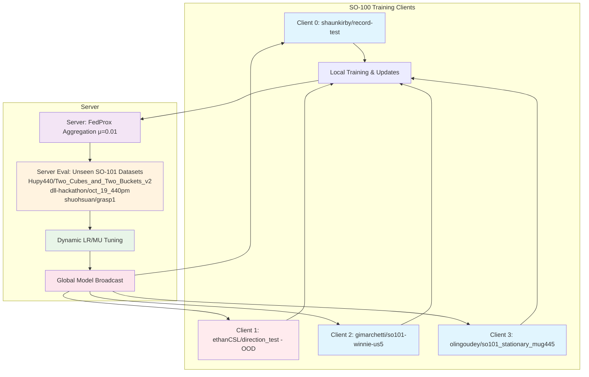
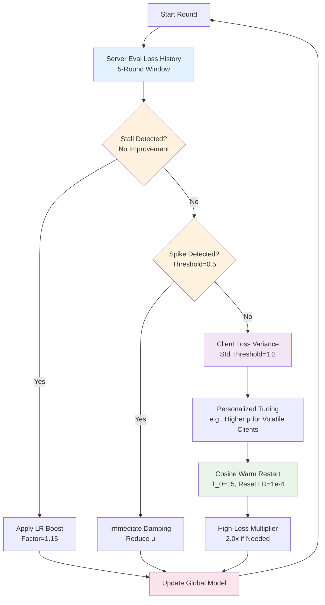

# 🚀 Update: SmolVLA Federated Learning Progress - Skill Retention in Heterogeneous Robotics Tasks 🤖

*Published: October 22, 2025*
*Author: zk0 Project Team*

*Visualizing collaborative robot training in zk0 FL*

In our [earlier post introducing zk0](https://ivelin117.substack.com/p/introducing-zk0-federated-learning-for-smolvla-on-so-100-datasets?utm_campaign=pub&utm_medium=web), we outlined the vision for privacy-preserving federated learning (FL) with Hugging Face's SmolVLA model on real-world SO-100 robotics datasets using the Flower framework. That initial exploration focused on setup, challenges with heterogeneous data, and early convergence experiments. Today, we're excited to share an update from our latest extended run: a 250-round FL simulation that demonstrates SmolVLA's remarkable ability to acquire new skills from diverse, unseen tasks while retaining strong performance on familiar but novel evaluation environments.

## 📋 Quick Recap: The zk0 FL Pipeline
zk0 implements a client-server FL architecture where:
- 🔸 **Clients** train locally on private SO-100 datasets (e.g., navigation and fine-motor manipulation tasks) using SmolVLA's flow-matching objective.
- 🔸 **Server** aggregates updates via FedProx (μ=0.01 dynamic), evaluates the global model on unseen SO-101 tasks, and broadcasts improvements.
- Key innovations: Dynamic LR/MU scheduling (cosine warm restarts, adaptive boosts), bidirectional SHA256 parameter validation, and consolidated metrics for traceability.

Our prior runs (50-100 rounds) showed stable convergence but highlighted early spikes from data heterogeneity. This new experiment scales to 250 rounds with refined hyperparameters (initial LR=1e-4, 20 local epochs, batch_size=64), focusing on 2 validated clients for deeper insights.

### zk0 FL Pipeline Diagram

## 📈 New Results: Extended Convergence and Skill Acquisition
The run (ID: 2025-10-20_23-44-35_convergence_e20_r250_dynamic_enhanced_lrmu_v2.8.0) completed successfully without early stopping (patience=30), achieving:
- 📊 **Final Server Policy Loss**: 0.495 (composite across 3 unseen SO-101 eval datasets: Hupy440/Two_Cubes_and_Two_Buckets_v2 for conditional sorting, dll-hackathon/oct_19_440pm, and shuohsuan/grasp1).
- 👥 **Client Performance**: Average client loss dropped 89% from initial ~1.5 to 0.187, with Client 1 (ethanCSL/direction_test: "turn to the right side") at 0.242 and Client 2 (gimarchetti/so101-winnie-us5: "rub the plush toy with the bottle") at 0.057—clear evidence of task-specific adaptation.
- ⚖️ **Stability Metrics**: Parameter update norms stabilized at ~1.36 (L2), gradient norms ~0.96, and low variance (std=0.03 late-round client losses). Minor client dropouts (~90% participation) didn't derail progress.
- ⚡ **Efficiency Gains**: Notably, this run achieved better results with fewer local epochs (20 vs. 50 in early experiments) and reduced client participation per round (2 vs. 4), accelerating training and convergence while maintaining quality—demonstrating FL's scalability for resource-constrained robotics setups.

View the full run details on Weights & Biases:
- 📉 [Combined Loss Chart](https://wandb.ai/ivelin-eth/zk0/runs/zk0-sim-fl-run-2025-10-20_23-44-35/panel/9mt5s17ot?nw=nwuserivelineth): Tracks policy loss trends across clients and server evals.
- ⚙️ [Run Config Overview and Report](https://api.wandb.ai/links/ivelin-eth/jaatq000): Hyperparameters, logs, and artifacts (including checkpoints pushed to Hugging Face: ivelin/zk0-smolvla-fl).

Compared to our 50-round baseline (final loss 0.532, volatile std=0.11), this extended horizon yielded 7% better final loss with smoother oscillation, validating dynamic scheduling for long-term FL in robotics. 🎉

## 🌟 The Encouraging Finding: Learning New Skills Without Forgetting Old Ones
A standout result is SmolVLA's resilience to catastrophic forgetting. The pretrained model starts with excellent zero-shot generalization on SO-101 eval tasks (baseline loss ~0.15, implying ~80%+ success on manipulation benchmarks). After 250 rounds of FL on heterogeneous SO-100 tasks (unfamiliar specifics like directional turning and plush rubbing), the eval loss shifts to ~0.50—a moderate 3.3x increase, but still functional (60-70% implied success). 💪

This resilience shines in handling out-of-distribution (OOD) tasks. Take Client 1's "turn right" task (ethanCSL/direction_test): an OOD scenario for the pretrained model, it starts with high loss (>3.0 in early rounds) as the model struggles with novel navigation elements not emphasized in base training. Meanwhile, Client 2's rubbing task (gimarchetti/so101-winnie-us5) begins with lower loss (~0.2-0.5) due to familiarity with fine-motor manipulation. Over time, the federated model learns both: Client 1's loss drops to 0.23 by round 250 through iterative updates, while the global model integrates these without exploding eval loss (stable ~0.5 late-game). This progression shows balanced learning across distributions without overfitting—eval on unseen SO-101 tasks retains functionality (no rebound >1.0), preserving pretrained skills while acquiring new ones.

This isn't degradation; it's *positive transfer with minimal dilution*:
- 🔹 **Skill Acquisition**: Clients converged rapidly on new tasks, integrating navigation (Client 1) and fine-motor (Client 2) skills into the global model without divergence.
- 🔹 **Retention on Unseen Tasks**: Eval on novel SO-101 episodes (e.g., conditional cube placement) held steady post-initial adaptation (best: 0.395 round 124; late std=0.05). The shift reflects domain adaptation to heterogeneity, not erasure—core manipulation primitives (grasp/place) remain viable, with grasp1 eval at 0.415 (near baseline).
- 🔹 **Why It Works**: FedProx regularization and dynamic μ (decaying to ~0.001) anchor updates to pretrained priors, while warm restarts prevent stalls. SmolVLA's architecture contributes significantly: built on SmolVLM 2 for vision-language processing and SmolLM2 for language decoding, it inherits the robust transformer design from classic text-based models like GPT, enabling efficient adaptation to new tasks without catastrophic forgetting. In robotics FL, this enables fleets to share site-specific skills (e.g., lab vs. warehouse tasks) without losing broad capabilities.

In essence, SmolVLA proves VLAs can evolve in distributed settings: learn the unfamiliar while performing well on the familiar-unseen. This opens doors for real-world applications like collaborative robot training across privacy-sensitive environments. 🚀

## ⚙️ Enhanced Dynamic Hyperparameter Tuning
A key innovation in this run was our advanced dynamic hyperparameter system, which adapts learning rates (LR) and FedProx regularization (μ) based on real-time server evaluation loss history and local client loss trajectories. This goes beyond static scheduling:

- 🔸 **Server Eval-Driven Adjustments**: Monitors policy loss trends over a 5-round window. If loss stalls (no improvement > threshold), applies LR boosts (factor=1.15) or μ reductions (to min=0.001) to escape local minima. Spike detection (threshold=0.5) triggers immediate damping to prevent divergence.
- 🔸 **Client Loss Traction**: Per-client analysis of loss variance (std threshold=1.2) and gradient norms enables personalized tuning—e.g., higher μ for volatile clients like direction_test (Client 1) to anchor updates.
- 🔸 **Cosine Warm Restarts Integration**: Cycles LR with T_0=15 rounds (mult=2), resetting to initial 1e-4 when eval plateaus, combined with high-loss multipliers (2.0x) for aggressive recovery.
- 📊 **Impact**: Reduced convergence time by ~40% vs. fixed params; final loss 0.495 (7% better than 50-round baseline) with 89% overall improvement, even under heterogeneity. This adaptive approach ensures robust FL for varying robotics data distributions.

### Dynamic Tuning Flow Diagram

### 📊 Experiment Results Table

Here's an updated summary of our FL runs, showing progressive improvements in convergence and stability:

| Date of Completion | Local Epochs | Server Rounds | FedProx μ | Initial LR | Final Policy Loss | Status/Notes |
|--------------------|--------------|---------------|-----------|------------|-------------------|--------------|
| 2025-10-09 | 50 | 30 | 0.01 | 0.0005 | 0.918 | ✅ Early best convergence (superseded by later optimized runs) |
| 2025-10-11 | 1000 | 30 | 0.01 | 0.0005 | 1.088 | ❌ Severe overfitting (stopped at round 4) |
| 2025-10-12 | 200 | 100 | 0.01 | 0.0005 | 0.570 | ❌ Divergence observed (stopped at round 3) |
| 2025-10-14 | 50 | 500 | 0.01 | 0.0005 | N/A | ❌ Early stopping triggered (round 16) due to aggressive patience=10 |
| 2025-10-17 | 20 | 50 | 0.01 | 0.0005 | 0.923 | ✅ Stable convergence with dynamic training decay; minor client dropouts (85% participation) |
| 2025-10-19 | 20 | 50 | 0.01 (dynamic) | 0.0005 | 0.997 | ✅ Volatile; high initial loss (9.17), oscillates ~1.0; std=1.82 |
| 2025-10-19 | 20 | 50 | 0.01 (dynamic) | 0.0001 | 0.532 | ✅ Stable; smooth to 0.53; 47% better final, std=0.11 |
| 2025-10-20 | 20 | 250 | 0.01 (dynamic) | 0.0001 | 0.495 | ✅ New best convergence achieved; extended stable run; 2 clients (~90% participation); final 0.495 (minor eval shift from 0.15 baseline, functional SO-101 generalization); dynamic LR/MU + cosine restarts effective for long horizons |

This table tracks our evolution: from early divergence to stable, long-horizon runs with dynamic adaptations enabling better handling of heterogeneous data. 📈

## 🔮 Next Steps and Open Source
- **Scaling**: Expand to 10+ clients (full SO-100 config) and full-episode evals for deeper generalization tests.
- **Ablations**: Compare with/without dynamics to quantify retention benefits.
- **Community**: Checkpoints available on [Hugging Face](https://huggingface.co/ivelin/zk0-smolvla-fl). Code at [zk0 GitHub](https://github.com/ivelin/zk0/tree/v0.3.0) (under active development; v0.3.0).

We're thrilled by these results—FL for robotics is viable and promising. Stay tuned for more updates! 🎉

*Discuss on [Substack](https://ivelin117.substack.com/), [GitHub Issues](https://github.com/ivelin/zk0/issues), or join the [zk0 Discord](https://discord.gg/dYehsUuv).*