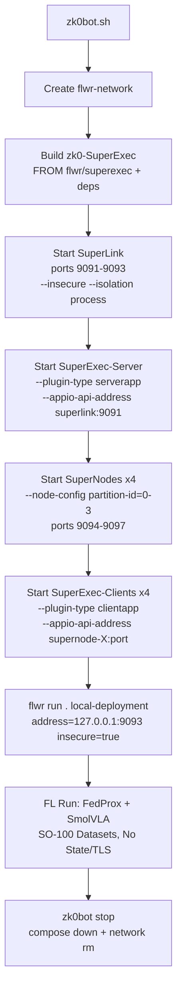

# zk0 Production CLI Refactor Sprint Plan

**Sprint ID**: zk0-cli-refactor-2025-11-08  
**Version**: 1.0.0  
**Author**: Kilo Code (Architect Mode)  
**Date Created**: 2025-11-08  
**Status**: Implementation in Progress - Core Fixes Complete, Network Blocked, Ready for Next Session
**Estimated Duration**: 2-4 hours in Code Mode  
**Dependencies**: Flower v1.23.0 Docker Images, Existing zk0 Dockerfiles/Compose Files  
**Constraints**: Work in project root (/home/ivelin/zk0); Use zk0 conda env for local testing; Focus on SmolVLA + Flower + SO-100; No external changes; Stateless/insecure mode only (no TLS/persistence).

## Executive Summary
This sprint refactors the zk0 production CLI (`zk0bot.sh`) to align with Flower's latest Docker best practices (v1.23.0 quickstarts for insecure, stateless client/server deployment). The current CLI uses basic Docker Compose for direct app execution but lacks Flower's Deployment Engine (SuperLink, SuperNodes, SuperExec). The refactor integrates these for orchestrated, stateless FL runs without TLS or state persistence, enabling easy dev/testing of SmolVLA federated training on SO-100 datasets.

**Goals**:
- Achieve stateless operation: No volumes/DBs; clean restarts.
- Use insecure mode: `--insecure` flags; unencrypted for dev.
- Maintain zk0 specifics: 4 clients for SO-100 tasks; FedProx strategy; SmolVLA integration.
- Version Bump: Minor (v0.6.0) post-implementation.

**Non-Goals**:
- TLS enablement (add in future sprint).
- State persistence (e.g., SuperLink DB).
- Production hardening (e.g., auth, scaling beyond 4 clients).

**Success Criteria**:
- `zk0bot start-server` launches SuperLink + SuperExec-Server.
- `zk0bot start-client --num 4` launches 4 SuperNodes + SuperExec-Clients.
- `flwr run . local-deployment` completes a tiny FL run (1 round) with policy loss logging, no errors.
- Cleanup via `zk0bot stop` leaves no artifacts (no state files, clean docker ps).
- Tests pass (pytest coverage >=36%); docs updated.

## Current State Analysis
- **zk0bot.sh**: Bash script with `start-server`, `start-client`, `stop`. Relies on dynamic Docker Compose detection (integrated `docker compose` preferred over legacy `docker-compose`) for `docker-compose.server.yml`/`docker-compose.client.yml`. Includes `pull_image` function for building SuperExec image. Direct app runs (e.g., `flwr.server.app src.server_app:app`); no SuperLink/SuperNode yet.
- **docker-compose.server.yml**: SuperLink (v1.22.0, ports 9091-9093, insecure) + serverapp (zk0:dev image, volumes for outputs/pyproject.toml, direct command).
- **docker-compose.client.yml**: SuperNode (v1.22.0) + clientapp (zk0:dev, volumes for datasets/outputs, env vars for HF_TOKEN/DATASET_URI).
- **Dockerfiles**: `Dockerfile.zk0` for zk0 image (conda/PyTorch/LeRobot/Flower). `superexec.Dockerfile` created (FROM huggingface/lerobot-gpu:latest for faster builds).
- **pyproject.toml**: FL configs present; `[tool.flwr.federations.local-deployment]` added. Updated to `flwr[simulation]==1.23.0`.
- **Completed Fixes**:
  - zk0bot.sh: Added `pull_image` function and dynamic compose detection.
  - superexec.Dockerfile: Created with lerobot-gpu base for faster builds.
  - pyproject.toml: Updated Flower version and added local-deployment federation.
- **Remaining Gaps**:
  - Docker Compose files not updated to SuperExec architecture.
  - No full refactor to SuperLink/SuperNodes.
  - Testing blocked by network connectivity (IPv6 unreachable for Docker Hub).

## High-Level Architecture
Refactored CLI orchestrates Flower Deployment Engine:
- **SuperLink**: Coordinator (flwr/superlink:1.23.0, --insecure --isolation process, ports 9091-9093).
- **SuperNodes**: Per-partition (flwr/supernode:1.23.0, --insecure --superlink superlink:9092, partition-id=0-3 num-partitions=4, ports 9094-9097).
- **SuperExec-Server**: zk0-based (FROM flwr/superexec:1.23.0 + pyproject.toml deps, --plugin-type serverapp --appio-api-address superlink:9091).
- **SuperExec-Clients**: Same image, scaled x4 (--plugin-type clientapp --appio-api-address supernode-X:port).
- **Network**: Bridge `flwr-network` for resolution (e.g., superlink:9091).
- **Flow**:
  1. CLI: Create network, build SuperExec image.
  2. Start server stack (Compose: SuperLink + SuperExec-Server).
  3. Start client stack (Compose: SuperNodes + SuperExec-Clients, scaled).
  4. User: `flwr run . local-deployment` connects to 127.0.0.1:9093.
  5. FL: Stateless SmolVLA training/aggregation.
  6. CLI: Stop/down + network rm.

Mermaid Flow Diagram:


## Step-by-Step Implementation Plan
Handover to Code Mode. Each step is atomic; update todos after each.

1. **Update Docker Compose Files** (Pending - Requires network resolution for testing)
   - `docker-compose.server.yml`:
     - Update SuperLink to v1.23.0, add --isolation process.
     - Rename serverapp → superexec-server: Build from superexec.Dockerfile, image=zk0-superexec:0.6.0, command=["--insecure", "--plugin-type", "serverapp", "--appio-api-address", "superlink:9091"], depends_on superlink.
     - Network: zk0-network → flwr-network (driver: bridge).
     - Remove volumes (stateless).
   - `docker-compose.client.yml`:
     - SuperNode: v1.23.0, --insecure --isolation process, --superlink superlink:9092, --node-config "partition-id=${PARTITION_ID} num-partitions=4", --clientappio-api-address 0.0.0.0:${NODE_PORT}.
     - clientapp → superexec-client: Build from superexec.Dockerfile, command=["--insecure", "--plugin-type", "clientapp", "--appio-api-address", "supernode:${NODE_PORT}"], depends_on supernode.
     - Add deploy: replicas=${NUM_CLIENTS:-4} for scaling.
     - Remove volumes/env for datasets (stateless; assume HF remote for SO-100).
     - Network: external flwr-network.
   - Test: `docker compose -f docker-compose.server.yml config` validates YAML.

2. **Create SuperExec Dockerfile** (Completed - Modified for faster builds)
    - New `superexec.Dockerfile`:
      ```
      FROM huggingface/lerobot-gpu:latest
      WORKDIR /workspace
      RUN uv pip install "flwr[superexec]==1.23.0"
      COPY pyproject.toml /workspace/pyproject.toml
      COPY src /workspace/src
      RUN uv pip install -e .
      ENV PATH="/lerobot/.venv/bin:$PATH"
      ENTRYPOINT ["flower-superexec"]
      ```
    - Builds zk0 deps atop lerobot-gpu base for faster builds; includes simulation extras for simplicity.

3. **Configure pyproject.toml** (Completed)
    - Added:
      ```
      [tool.flwr.federations.local-deployment]
      address = "127.0.0.1:9093"
      insecure = true
      ```
    - Updated Flower to `flwr[simulation]==1.23.0`.
    - Enables `flwr run . local-deployment`.

4. **Refactor zk0bot.sh** (Partially Completed - Core fixes done)
    - Added dynamic Docker Compose detection (integrated preferred over legacy).
    - Added `pull_image` function for building SuperExec image.
    - Network creation and basic commands updated.
    - Full SuperLink/SuperNodes refactor pending Docker Compose file updates.

5. **Test Feasibility** (Attempted - Blocked by Network)
    - Run attempted: `./zk0bot.sh server start` detected compose and network, but build failed on Docker Hub pull (IPv6 unreachable).
    - Once network resolved, test: `zk0bot start-server; zk0bot start-client; flwr run . local-deployment --run-config "num-server-rounds=1 local-epochs=1 batch_size=1" --stream`.
    - Verify: Logs show insecure connects, no TLS/state errors; policy loss logged; `zk0bot stop` cleans up.
    - Tiny FL: Confirm 4 clients train SmolVLA on SO-100 subsets.

6. **Documentation & Memory Bank** (Partially Completed)
    - Memory Bank context.md updated with progress and network blockage note.
    - README.md and NODE-OPERATORS.md updates pending full implementation.
    - tasks.md workflow addition pending.

7. **Version Bump & Release Prep** (Pending)
    - pyproject.toml: version bump to 0.6.0 pending full implementation.
    - Tests: Run in Docker once network resolved.
    - Commit and release pending successful testing.

## Risks & Mitigations
- **Port Conflicts**: Script checks `docker ps`; dynamic ports if needed.
- **Dep Install Fails**: Pin Flower 1.23.0 in pyproject.toml; test build locally.
- **SmolVLA Load Issues**: Ensure LeRobot in SuperExec; fallback to Dockerfile.zk0 if GPU deps conflict.
- **Scaling**: Hardcode 4 clients; env var for flexibility.
- **Rollback**: Revert Compose to originals if issues.

## Sprint Retrospective Criteria
- [x] zk0bot.sh: Add pull_image function (fixes "command not found" error)
- [x] zk0bot.sh: Add dynamic Docker Compose detection
- [x] superexec.Dockerfile: Created with lerobot-gpu base for faster builds
- [x] pyproject.toml: Updated to Flower 1.23.0 and added local-deployment federation
- [x] Memory Bank context.md updated with progress
- [ ] Docker Compose files updated to SuperExec architecture
- [ ] Full zk0bot.sh refactor to SuperLink/SuperNodes
- [ ] Tiny FL run succeeds statelessly (blocked by network)
- [ ] Docs updated (README.md, NODE-OPERATORS.md)
- [ ] Version 0.6.0 ready

Reference this file across sessions. Proceed to Code Mode for implementation?